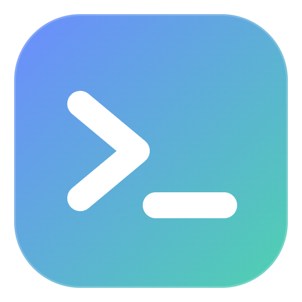
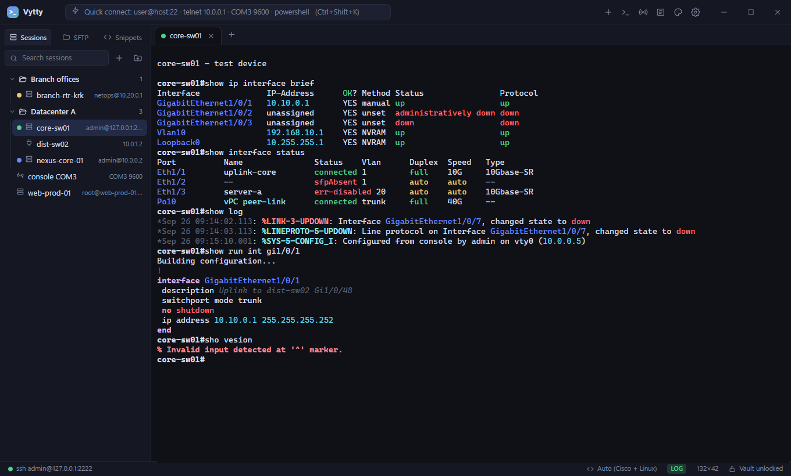
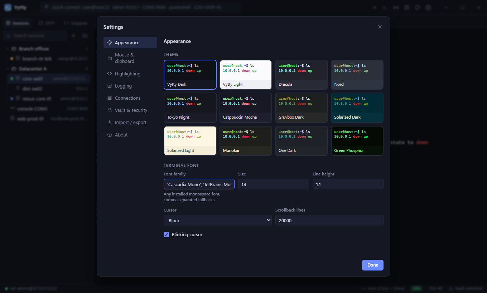

<p align="center">
  
</p>

<h1 align="center">Vytty</h1>

<p align="center">
  <b>A portable, minimal terminal for network and Linux work.</b><br>
  SSH · Telnet · Serial · Local shells · SFTP · Encrypted password vault · Daily logs · Cisco / Nexus / Linux highlighting
</p>

<p align="center">
  
</p>

Vytty takes the parts of MobaXterm and SecureCRT that you use every day and leaves out the rest. It is one
portable executable: no installer, no registry, no AppData. Sessions, settings, the vault and logs all live in a
`VyttyData` folder next to the `.exe`, so you can carry the whole setup on a USB stick.

## Features

**Connections**
- SSH (password, private key incl. `.ppk`, Pageant/OpenSSH agent, keyboard-interactive/MFA)
- SSH jump host (bastion), local port forwarding and SOCKS5 dynamic forwarding
- "Legacy algorithms" switch for old Cisco IOS boxes (`diffie-hellman-group1`, `ssh-rsa`, `aes-cbc`)
- Telnet with NAWS/TTYPE negotiation and **auto-login** (answers `Username:` / `Password:` prompts)
- Serial console (COM ports; baud, data bits, parity, stop bits, flow control)
- Local shells: PowerShell, pwsh, CMD, WSL, Git Bash, bash/zsh
- Host key verification with a `known_hosts` store and a loud warning when a key changes

**Sessions**
- Session tree with folders and subfolders, drag & drop, search (name, host, user, folder, notes)
- Per-session name, color, highlight profile, logging on/off, startup commands and notes
- Quick connect bar: `user@host:22`, `ssh -p 2222 host`, `telnet 10.0.0.1 23`, `COM3 9600`, `powershell`
- Duplicate, open all sessions in a folder, save a quick-connect tab as a session
- Import / export (passwords optionally included, encrypted with an export password)

**Password vault**
- Every saved session can have its own password / key passphrase
- AES-256-GCM, key derived with scrypt from a master password that is never stored
- Optional "no master password" mode for convenience (clearly labelled as obfuscation only)
- Passwords typed at connect time can be saved to the vault with one checkbox

**Syntax highlighting**
- Profiles: **Cisco IOS / IOS-XE (Catalyst)**, **Cisco NX-OS (Nexus)**, **Linux**, **Auto** (all of them) or none
- Interfaces (`GigabitEthernet1/0/1`, `Te1/1/1`, `Eth1/1`, `Po10`, `Vlan10`, `mgmt0`…), IPv4/IPv6, MAC addresses
- Up/down/err-disabled/sfpAbsent/notconnect states, syslog mnemonics coloured by severity (`%LINK-3-UPDOWN`)
- CLI errors (`% Invalid input`), prompts, config sections, `no` commands, descriptions, route codes
- Linux: `[  OK  ]` / `[FAILED]`, error/warning words, disk usage percentages, dates
- Output that is already coloured by the remote side, and full-screen apps (vim, htop, less), are left untouched
- Custom regex rules with a live preview

**Logging**
- One log file per day: `VyttyData/logs/YYYY-MM-DD.log`
- Every session of that day **appends** to the same file, with OPEN/CLOSE markers
- Optional `[HH:MM:SS]` and `[session name]` prefix on every line; escape codes and backspaces are cleaned up
- Log folder is configurable

**Quality of life (MobaXterm-style)**
- Copy on select, paste on right click, paste on middle click (all configurable; Shift+right click = menu)
- Confirmation before pasting multiple lines
- **Multi-exec**: type once into every tab at the same time (per-tab opt-out)
- SFTP side panel for the active SSH tab: browse, download, upload (also drag & drop files onto the terminal), rename, delete, mkdir, "cd here"
- Snippets / macros sent with one click (`\n` = Enter, `\x03` = Ctrl+C)
- Press **R** in a disconnected tab to reconnect
- Find in scrollback (regex, match case), Ctrl+wheel zoom, clickable links (Ctrl+click)
- Tab rename, drag to reorder, color, activity indicator, close others / to the right
- Visual or audible bell, 20 000 lines of scrollback (configurable)

**Themes**

12 built-in themes that style both the UI and the terminal: Vytty Dark, Vytty Light, Dracula, Nord, Tokyo Night,
Catppuccin Mocha, Gruvbox Dark, Solarized Dark, Solarized Light, Monokai, One Dark, Green Phosphor.

<p align="center"></p>

## Download

Grab `Vytty-x.y.z-portable.exe` from the [Releases](https://github.com/mtgmz14/vytty/releases) page and run it.
The first start creates `VyttyData` next to the executable and asks you to set up the vault.

## Keyboard shortcuts

| Shortcut | Action |
| --- | --- |
| `Ctrl+Shift+N` | New session |
| `Ctrl+Shift+K` | Quick connect |
| `Ctrl+Shift+E` | Search sessions |
| `Ctrl+Shift+T` | Duplicate tab |
| `Ctrl+Shift+W` | Close tab |
| `Ctrl+Tab` / `Ctrl+Shift+Tab` | Next / previous tab |
| `Alt+1` … `Alt+9` | Go to tab |
| `Ctrl+Shift+C` / `Ctrl+Insert` | Copy |
| `Ctrl+Shift+V` / `Shift+Insert` | Paste |
| `Ctrl+Shift+F` | Find |
| `Ctrl+Shift+M` | Toggle multi-exec |
| `Ctrl+Shift+R` | Reconnect |
| `Ctrl+Shift+L` | Clear scrollback |
| `Ctrl+Shift+B` | Toggle sidebar |
| `Ctrl+=` / `Ctrl+-` / `Ctrl+0` | Zoom in / out / reset |
| `Ctrl+,` | Settings |
| `F11` | Full screen |

## Data folder

```
Vytty-0.1.0-portable.exe
VyttyData/
  settings.json      UI and terminal settings, snippets
  sessions.json      folders and sessions (no passwords)
  vault.json         encrypted credentials
  known_hosts.json   trusted SSH host key fingerprints
  logs/2026-09-26.log
```

## Building from source

Requirements: Node.js 20+ and npm.

```bash
git clone https://github.com/mtgmz14/vytty.git
cd vytty
npm install
npm start            # run from source (data goes to ./data)
npm run dist:win     # build dist/Vytty-<version>-portable.exe
npm run dist:linux   # build an AppImage
```

Pushing a `v*` tag builds Windows and Linux binaries on GitHub Actions and attaches them to the release.

## Tech

Electron, [xterm.js](https://xtermjs.org/), [ssh2](https://github.com/mscdex/ssh2), [serialport](https://serialport.io/),
[node-pty](https://github.com/microsoft/node-pty). The renderer is plain JavaScript with no framework and runs
sandboxed with context isolation; all network and file access goes through a small preload API.

## Roadmap

- Split panes inside a tab
- X11 forwarding, RDP/VNC launchers
- Recursive SFTP folder transfers
- Session-level credential profiles shared by many devices

## Po polsku

Vytty to przenośny (portable) terminal SSH / Telnet / Serial dla sieciowców i adminów Linuksa: drzewo sesji z
folderami, zaszyfrowany sejf haseł dla każdej sesji, podświetlanie składni Cisco Catalyst / Nexus / Linux, dzienne
pliki logów (wszystkie sesje z danego dnia dopisują się do jednego pliku), kopiowanie po zaznaczeniu i wklejanie
prawym przyciskiem, multi-exec, panel SFTP, snippety i 12 motywów. Wszystkie dane są w folderze `VyttyData` obok pliku `.exe`.

## License

[MIT](LICENSE)
